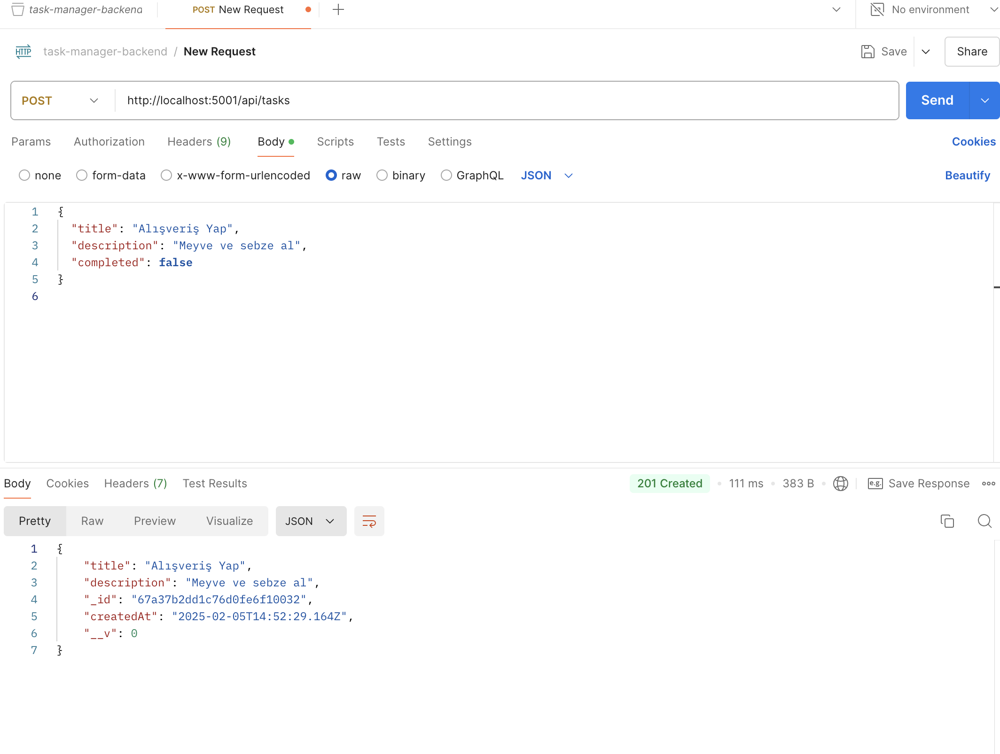
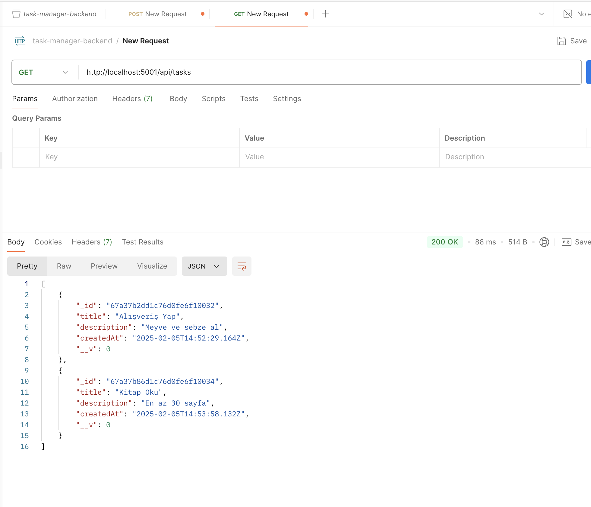
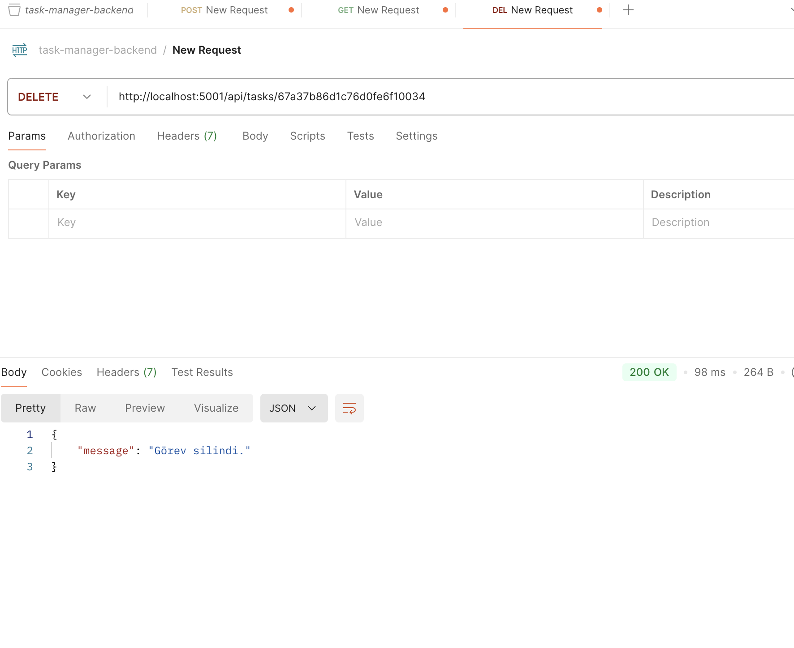

# Task API

Bu proje, görev yönetim API'sini geliştirmek için oluşturulmuştur. Kullanıcılar görev ekleyebilir, tüm görevleri listeleyebilir ve görev silebilir.

## Kullanılan Teknolojiler

- **Node.js**: JavaScript çalışma zamanı
- **Express.js**: Web framework
- **MongoDB**: Veritabanı
- **Mongoose**: MongoDB için Object Data Modeling (ODM) kütüphanesi
- **dotenv**: Çevresel değişkenleri yönetmek için

## Başlangıç

### Gereksinimler

- Node.js
- MongoDB veritabanı

## Postman Çıktıları

Aşağıda, Postman ile yapılan bazı API isteklerinin çıktıları yer almaktadır.

### 1. Görev Ekleme (POST /api/tasks)

Bu, başarılı bir görev ekleme isteği sonrasında alınan yanıttır. Başlık ve açıklama başarıyla gönderildiğinde, API tarafından oluşturulan görev verisi geri dönmektedir.

### 2. Tüm Görevleri Getirme (GET /api/tasks)

Bu istek, veritabanındaki tüm görevleri listelemektedir. Burada birden fazla görev JSON formatında döndürülmektedir.

### 3. Görev Silme (DELETE /api/tasks/:id)

Bu, belirli bir görev ID'si ile yapılan silme isteği sonrasında alınan yanıttır. Görev başarıyla silindiğinde, "Görev silindi." mesajı döndürülür.